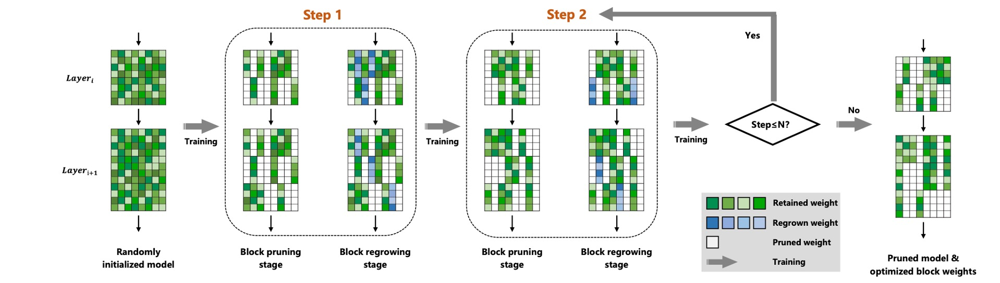
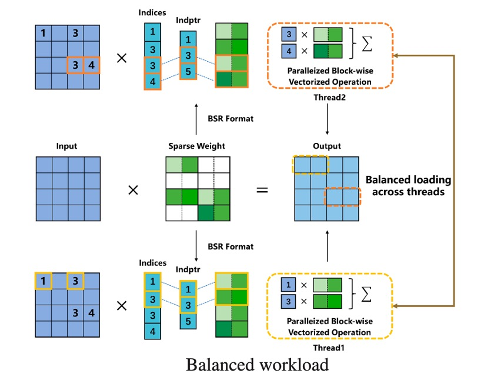

# [NeurIPS 2023] SUBP: Soft Uniform Block Pruning for 1xN Sparse CNNs Multithreading Acceleration ([Paper Link](https://arxiv.org/abs/2310.06218))

[Jingyang Xiang](https://jingyangxiang.github.io/), Siqi Li, Jun Chen, Shipeng Bai, Yukai Ma, Guang Dai, [Yong Liu](https://april.zju.edu.cn/team/dr-yong-liu/)


Pytorch implementation of SUBP in NeurIPS2023.

Main code can be found in ```./models/conv_type/regrow_uniform_block_v2.py```

## Framework
<div align=center></div>

## Acceleration

<div align=center></div>

## Introduction

In this paper, we propose a soft uniform block pruning method for 1xN sparse acceleration on multithreading CPUs.

## Prepare ImageNet1K

Create a data directory as a base for all datasets. 
For example, if your base directory is ```/datadir/dataset```then imagenet would be located at ```/datadir/dataset/imagenet```.
You should place train data and val data in ```/datadir/dataset/imagenet/train``` and ```/datadir/dataset/imagenet/val``` respectively.

## Training on ImageNet1K

All scripts can be obtained in ```./scripts/generate_scripts.py```

```shell
python ./scripts/generate_scripts.py
```

```shell
python pruning_train.py [DATA_PATH] --set ImageNet -a [ARCH] --no-bn-decay True --save_dir [SAVE_DIR] \
--warmup-length 0 --N [N] --M 16 --conv-type [CONV_TYPE] --weight-decay 0.0001 --nesterov False \
--workers 16 --prune-rate [PRUNE_RATE] --batch-size [BATCH_SIZE] --lr [LEARNING_RATE]
```

## Results on ImageNet1K

All models can be obtained in [OpenI](https://www.openi.org.cn/) community. Many thanks to OpenI for the storage space!

| name        | N for N:M Sparsity | FLOPs | use dali | Top-1 Accuracy | Top-5 Accuracy |                                     model & log                                     |
|:------------|:------------------:|:-----:|:--------:|:--------------:|:--------------:|:-----------------------------------------------------------------------------------:|
| resnet18    |         16         | 1.03G |    ✘     |      69.9      |      89.3      | [link](https://openi.pcl.ac.cn/ZJUTER0126/NeurIPS2023_SUBP/modelmanage/show_model)  | 
| resnet18    |         32         | 1.03G |    ✘     |      69.7      |      89.2      | [link](https://openi.pcl.ac.cn/ZJUTER0126/NeurIPS2023_SUBP/modelmanage/show_model)  |
| resnet34    |         16         | 2.0G  |    ✘     |      74.1      |      91.7      | [link](https://openi.pcl.ac.cn/ZJUTER0126/NeurIPS2023_SUBP/modelmanage/show_model)  | 
| resnet34    |         32         | 2.0G  |    ✘     |      73.9      |      91.6      | [link](https://openi.pcl.ac.cn/ZJUTER0126/NeurIPS2023_SUBP/modelmanage/show_model)  |
| resnet50    |         16         | 2.0G  |    ✘     |      77.6      |      93.6      | [link](https://openi.pcl.ac.cn/ZJUTER0126/NeurIPS2023_SUBP/modelmanage/show_model)  |
| resnet50    |         32         | 2.0G  |    ✘     |      77.4      |      93.3      | [link](https://openi.pcl.ac.cn/ZJUTER0126/NeurIPS2023_SUBP/modelmanage/show_model)  |
| resnet50    |         16         | 1.0G  |    ✘     |      76.3      |      92.6      | [link](https://openi.pcl.ac.cn/ZJUTER0126/NeurIPS2023_SUBP/modelmanage/show_model)  |
| resnet50    |         32         | 1.0G  |    ✘     |      76.0      |      92.6      | [link](https://openi.pcl.ac.cn/ZJUTER0126/NeurIPS2023_SUBP/modelmanage/show_model)  |
| mobilenetv1 |         16         | 279M  |    ✘     |      71.5      |      90.2      | [link](https://openi.pcl.ac.cn/ZJUTER0126/NeurIPS2023_SUBP/modelmanage/show_model)  |
| mobilenetv1 |         32         | 279M  |    ✘     |      71.1      |      89.7      | [link](https://openi.pcl.ac.cn/ZJUTER0126/NeurIPS2023_SUBP/modelmanage/show_model)  |

## Testing on ImageNet1K

```bash
python pruning_train.py [DATA_PATH] --set ImageNet -a [ARCH] --no-bn-decay True --save_dir [SAVE_DIR] \
--warmup-length 0 --N [N] --M 16 --conv-type [CONV_TYPE] --weight-decay 0.0001 --nesterov False \
--workers 16 --prune-rate [PRUNE_RATE] --batch-size [BATCH_SIZE] --lr [LEARNING_RATE] \
--pretrained [PRETRAINED_PATH] --evaluate
```

### Testing log for 1x16 ResNet18 on ImageNet1K

```
[2024-03-03 15:42:11] Test: [0/1000]	Time 1.471 (1.471)	Loss 1.4947 (1.4947)	Prec@1 92.000 (92.000)	Prec@5 96.000 (96.000)
[2024-03-03 15:42:13] Test: [100/1000]	Time 0.017 (0.031)	Loss 1.3180 (1.9283)	Prec@1 96.000 (77.941)	Prec@5 100.000 (92.792)
[2024-03-03 15:42:15] Test: [200/1000]	Time 0.019 (0.024)	Loss 2.1297 (1.9438)	Prec@1 62.000 (77.104)	Prec@5 100.000 (92.935)
[2024-03-03 15:42:16] Test: [300/1000]	Time 0.017 (0.022)	Loss 1.4819 (1.9311)	Prec@1 92.000 (76.711)	Prec@5 94.000 (93.542)
[2024-03-03 15:42:18] Test: [400/1000]	Time 0.018 (0.020)	Loss 2.9675 (1.9333)	Prec@1 34.000 (76.713)	Prec@5 82.000 (93.551)
[2024-03-03 15:42:20] Test: [500/1000]	Time 0.012 (0.020)	Loss 1.4595 (2.0340)	Prec@1 94.000 (74.279)	Prec@5 100.000 (92.040)
[2024-03-03 15:42:21] Test: [600/1000]	Time 0.016 (0.019)	Loss 4.0964 (2.0947)	Prec@1 22.000 (72.922)	Prec@5 56.000 (91.085)
[2024-03-03 15:42:23] Test: [700/1000]	Time 0.021 (0.019)	Loss 2.8167 (2.1422)	Prec@1 62.000 (71.738)	Prec@5 78.000 (90.354)
[2024-03-03 15:42:25] Test: [800/1000]	Time 0.017 (0.018)	Loss 1.6174 (2.1819)	Prec@1 86.000 (70.821)	Prec@5 96.000 (89.738)
[2024-03-03 15:42:26] Test: [900/1000]	Time 0.014 (0.018)	Loss 1.4955 (2.2120)	Prec@1 94.000 (69.991)	Prec@5 94.000 (89.223)
[2024-03-03 15:42:28]  * Prec@1 69.974 Prec@5 89.266 Error@1 30.026
```

## Optional arguments

```
optional arguments:
    # misc
    --save_dir                  Path to save directory
    
    # for model                         
    --arch                      Choose model
                                default: resnet18
                                choice: ['resnet18', 'resnet34', 'resnet50', 'mobilenet_v1']
    --conv-bn-type              convbn type for network
                                default: SoftMaxQConv2DBN
      
    # for datatset
    data                        Path to dataset
    --set                       Choose dataset
                                default: ImageNet
                                choice: ["ImageNet", "ImageNetDali"]   
                                                 
    # for pretrain, resume or evaluate
    --evaluate                  Evaluate model on validation set
    --pretrained                Path to pretrained checkpoint

    # 1xN sparsity
    --N                         N for 1xN sparsity
                                default: 16

    # progressive pruning
    --decay-start               Start to prune
                                default: 10
    --decay-end                 Start to prune
                                default: 180   
    --prune-schedule            Prune schedule
                                default: cubic
                                choice: ['linear', 'exp', 'cos', 'cubic']          
    --prune-rate                Prune rate for 1xN Sparse Network
                                default: 0.0
    --prune-criterion           Prune criterion
                                default: L1
                                choice: ['L1', 'L2', 'BPAR']
```

## Dependencies

- Python 3.9.16
- Pytorch 2.0.0
- Torchvision 0.15.1
- nvidia-dali-nightly-cuda110 1.27.0.dev20230531
- nvidia-dali-tf-plugin-nightly-cuda110 1.27.0.dev20230531

## THANKS

Special thanks to the authors and contributors of the following projects:

- [filter-pruning-geometric-median](https://github.com/he-y/filter-pruning-geometric-median)
- [soft-filter-pruning](https://github.com/he-y/soft-filter-pruning)